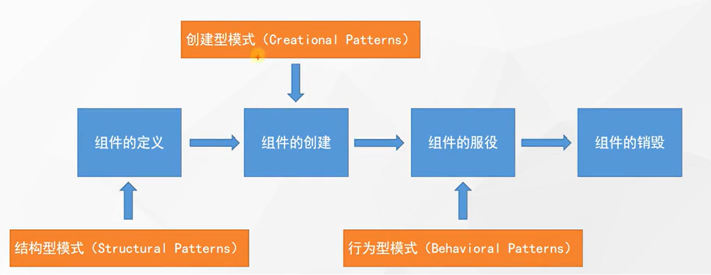
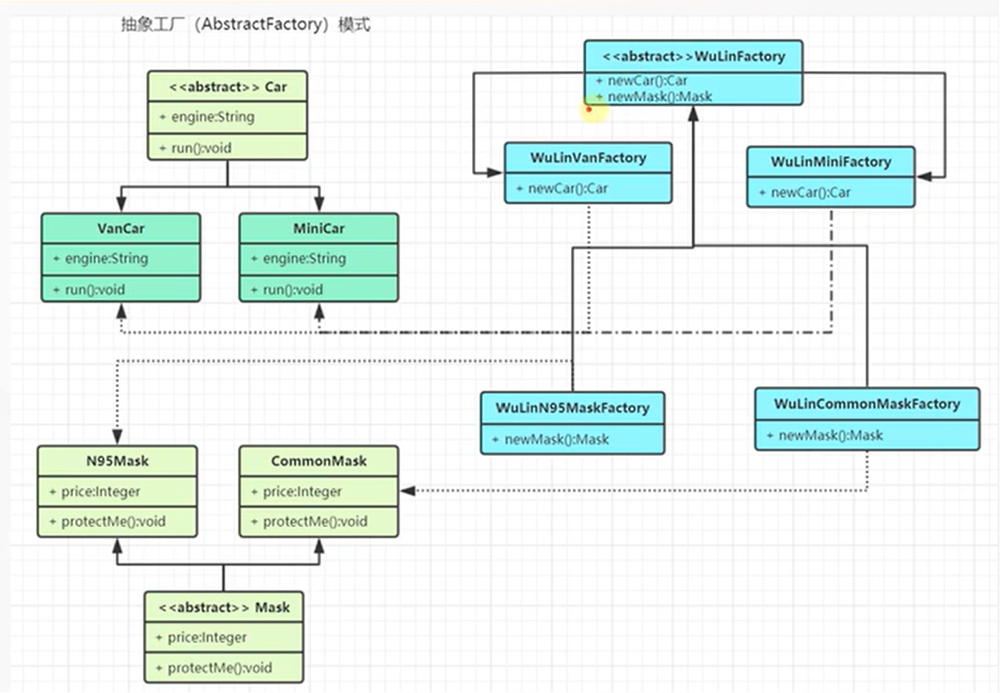
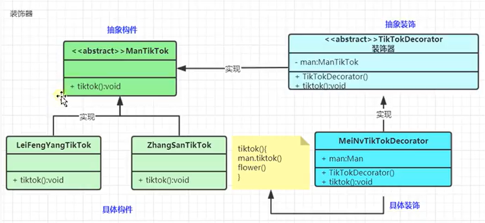
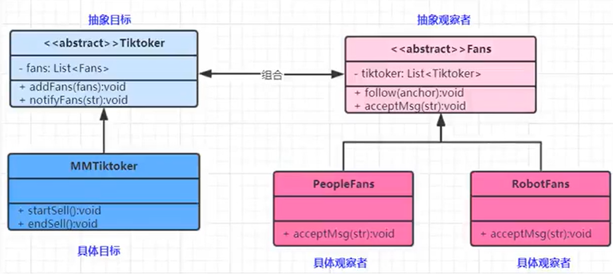

# 设计模式

>设计模式可以大致分为三个部分：结构型模式，创建型模式，行为型模式。

对于每种模式，选取了一部分进行学习。




## 创建型模式
创建型模式关注 “怎样创建出对象”，以及“如何将对象的创建与使用分离开”，以降低系统的耦合度。

### 单例模式
>一个类仅有一个实现，且能够全局访问

可以实现的方式有：构造器私有，对外部提供实例化方法，且在此方法中实现唯一性

```
private Person() {
    ...init...
}

public static synchronized Person stuff() {
    if (instance == null) {
        Person person = new Person()
        instance = person;
    }
    return instance;
}
```

### 工厂模式
>工厂模式提供了一种创建对象的最讲方式。我们不必关心对象的创建细节，只需要根据不同的情况获取不同的产品即可

工厂模式下有简单工厂、工厂方法、抽象工厂的细分
- 简单工厂一般应用于产品数量不多的时候，扩展性差
- 工厂方法使用实现类的方式来实现单一产品的生产，产品较多时工厂较多，系统结构较为复杂
- 抽象工厂在工厂方法的基础上，一个方法可以生产多个产品，良好地减少了工厂数量

抽象工厂：


### 建造者模式
>适用于单个产品较为复杂，实现细节较多的情况

如手机，可以如下设计：
AbstractPhoneBuilder -> PhoneBuilder -> Phone
在PhoneBuilder中可以添加大量细节。


## 结构型模式
结构型模式关注 “怎样组合对象和类”。其中，类结构型模式关注类的组合，对象结构型模式关注类与对象的组合，通过关联关系在一个类中定义另一个类的实例对象，用关联关系来替代继承关系。

### 适配器模式
>两个不兼容接口之间适配的桥梁

将一个接口转换为所需的另一个接口，它主要包含以下角色：
- 目标接口(Target)，可以是抽象类或接口
- 适配接口(Adaptee)，隐藏的转换接口
- 适配器(Adapter)，转换器，通过继承或者引用适配接口，把适配接口转换为目标接口

```
public class Movie implements Plyaer {
    private Player target;
    public Movie(Player target) {
        this.target = target;
    }
}
```

### 装饰器模式
>向一个现有的对象添加新的功能，同时不改变其结构

与适配器的区别：适配器是连接两个类，增强了其中一个类的功能；装饰器是直接增强了一个类的功能。



### 代理模式
>给某一个对象提供一个代理，并由代理对象控制对原对象的引用，可划分为静态代理和动态代理。

主要包含如下角色：
- Subject：抽象主体角色
- Proxy：代理主体角色
- RealSubject：真实主体角色（被代理的对象类）

动态代理原理：字节码重组

1、拿到被代理对象的引用，并且获取到它的所有的接口，反射获取
2、JDK Proxy类重新生成一个新的类、同时新的类要实现被代理类所有实现的所有的接口
3、动态生成Java代码，把新加的业务逻辑方法由一定的逻辑代码去调用（在代码中体现）
4、编译新生成的Java代码.class
5、再重新加载到JVM中运


## 行为型模式

行为型模式关注 “怎么样运行对象和类”，它用于描述程序在运行时的复杂流程控制。

行为型模式分为类行为模式和对象行为模式，前者采用继承机制来在类间分派行为，后者采用组合或聚合在对象间分配行为。一般而言，对象行为模式比类行为模式耦合度更低，灵活性更大。

### 策略模式
>每种算法独立封装，根据不同的情况使用不同的算法策略

主要角色如下：
- 抽象策略类，公共接口。不同的算法以不同方式实现这个接口，环境角色用这个接口调用不同的算法
- 具体策略类，实现了抽象策略定义的接口，提供具体的算法实现
- 环境类，持有一个策略类的引用，最终给客户端调用

```
环境类
public class Game {
    privateGameStrategy strategy1; //策略类
    public void setStrategy1(...) {
        ...
    }
    pulic void startGame() {
        ...
    }
}
```

### 观察者模式
>维护多个观察者依赖，状态变化通知所有观察者。
定义对象间的一种一对多依赖关系，使得当一个对象状态改变时，其依赖对象皆得到通知并被自动更新。


